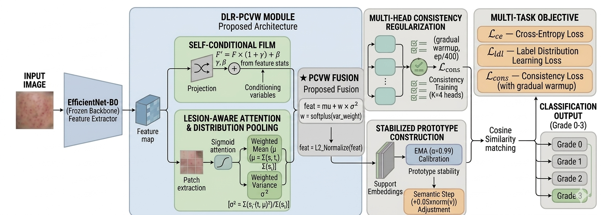
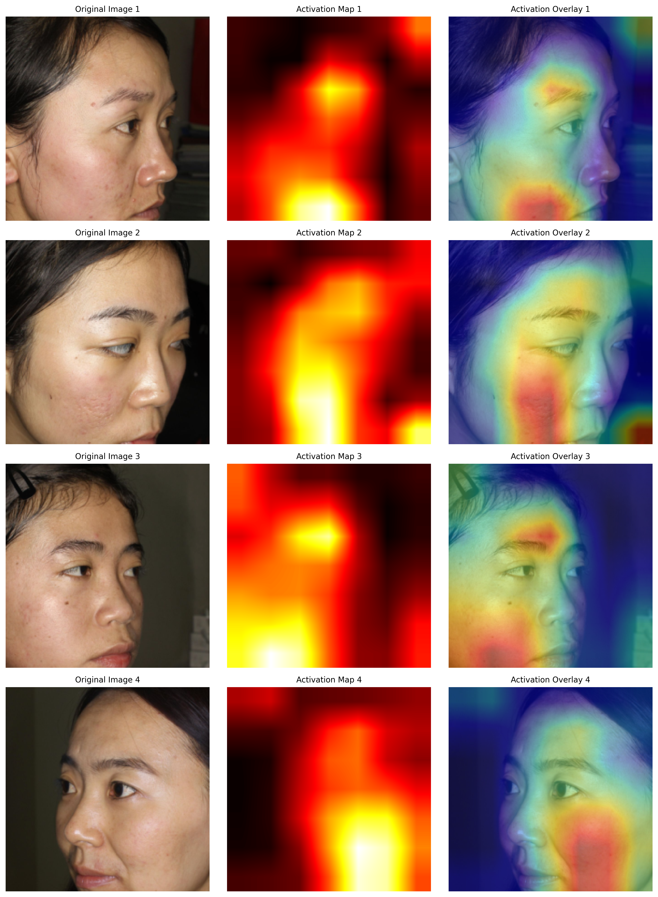

# 🧬 DLR-PCVW

### Distribution-Aware Few-Shot Learning for Acne Severity Classification

**🎓 Research Prototype · Thesis Demonstration**

---

## 📋 Overview

**DLR-PCVW** is a **Few-Shot Learning** framework designed for classifying acne severity into 4 grades. It leverages a **Distribution-aware Lesion Representation** with **Prototype-based Classification** to achieve robust performance with limited data — making it ideal for medical imaging applications where labeled data is scarce.

### 🎯 Key Features

| Feature | Description |
|---------|-------------|
| **4-Way Classification** | Clear, Mild, Moderate, Severe |
| **Few-Shot Learning** | 1, 3, 5, or 10-shot inference |
| **Ensemble Model** | 5 seeds for robust predictions |
| **Attention Visualization** | Lesion focus maps for interpretability |
| **Prototype Similarity** | Compare with class prototypes |
| **Interactive UI** | Drag-and-drop image upload |
| **Dark Theme** | Modern glassmorphism UI |

---

## 🏗️ Architecture

  
   
  <em>DLR-PCVW: Distribution-aware Lesion Representation with Prototype-based Few-Shot Classification</em>

### Pipeline Overview

| Step | Component | Description |
|:----:|-----------|-------------|
| **1** | 📥 Input | 224×224 RGB Image |
| **2** | 🔍 Feature Extractor | EfficientNet-B0 (Pre-trained) |
| **3** | 🎯 FiLM Calibration | Feature-wise Linear Modulation |
| **4** | 👁️ Lesion Attention | Soft Attention Map for Lesions |
| **5** | 📊 PCVW Representation | μ + w·σ (Variance Weighted) |
| **6** | 🧩 Prototype Network | Cosine Similarity to Prototypes |
| **7** | ✅ Output | 4-Way Severity Grades |

### Model Specifications

| Component | Details |
|-----------|---------|
| **Framework** | DLR-PCVW |
| **Backbone** | EfficientNet-B0 (Pre-trained) |
| **Learning** | Few-Shot Learning |
| **Task** | 4-Way Classification |
| **Input** | 224 × 224 |
| **Trainable Parameters** | 6.93M |
| **Ensemble** | 5 Random Seeds |

---

## 📊 Model Performance

*Results averaged across 5 random seeds:*

| Shot | Accuracy | Confidence Interval |
|------|----------|---------------------|
| **1-Shot** | 76.65% | ± 1.00% |
| **3-Shot** | 79.40% | ± 0.73% |
| **5-Shot** | 79.60% | ± 0.62% |
| **10-Shot** | 80.27% | ± 0.43% |

This is internal performance and showing feature ectivations

  

---

📂 Project Structure
DLR-PCVW-Acne-severity-classifier-using-few-shot/
├── app.py                          # Main Streamlit application
├── requirements.txt                # Python dependencies
├── pyproject.toml                  # Project configuration
├── create_support_set.py           # Support set generator
├── README.md                       # Documentation
├── image/
│   └── proposed_architecture.png   # Architecture diagram
├── .streamlit/
│   └── config.toml                 # Streamlit configuration
├── saved_models/                   # Auto-downloaded model cache
│   └── ensemble_models.pt          # Ensemble model (141MB)
└── support_set/                    # Auto-downloaded support set
    └── support_set.pt              # Support images

🔬 Technical Details
DLR-PCVW Components
Feature Extraction: EfficientNet-B0 extracts 1280-dimensional features

FiLM Calibration: Feature-wise modulation for task adaptation

Lesion Attention: Soft attention map highlighting lesion regions

PCVW Representation: μ + w·σ (learnable variance weighting)

Prototype Network: Cosine similarity to class prototypes

Training Configuration
Parameter	Value
Training Episodes	1,200
Testing Episodes	300
Optimizer	AdamW
Learning Rate	2e-4
Weight Decay	0.008
Scheduler	Cosine Annealing
Label Smoothing	0.05
Temperature	16.0

Loss Functions
Cross-Entropy Loss: Standard classification loss

LDL Loss: Label Distribution Learning

Consistency Loss: Multi-head consistency
